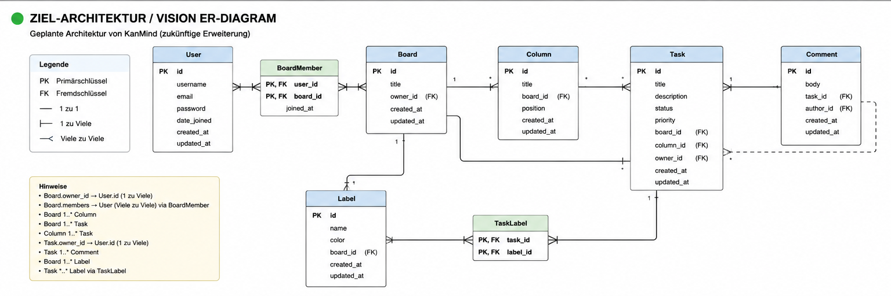
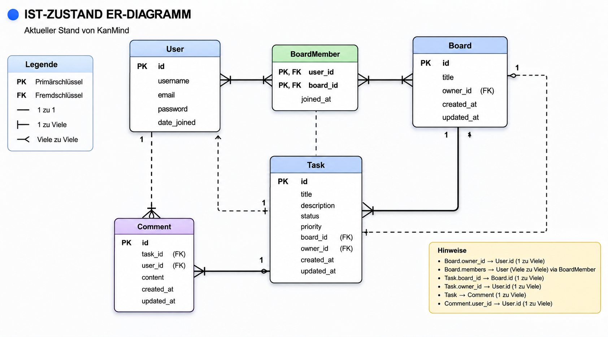

KanMind 🧠

KanMind is a fullstack Kanban-style productivity application built with Django REST Framework (backend) and a modern frontend.

Features

- User Registration API
- User Login with Token Authentication
- Protected User Profile Endpoint (/api/auth/me/)
- Board System (Kanban Core Module)
- Full CRUD Board API (Create, Read, Update, Delete)
- Task System (in progress)
- Django REST Framework API
- Clean modular backend structure
- Git-clean project setup with proper .gitignore
- Frontend (vanilla HTML/CSS/JS) prepared for integration

Tech Stack

Backend
- Python 3.14
- Django 6
- Django REST Framework
- Token Authentication (DRF)

Frontend
- HTML5
- CSS3
- JavaScript (Vanilla)

Authentication Flow

1. Register user:
POST /api/auth/register/

2. Login user:
POST /api/auth/login/

3. Receive token:
Token <your_token>

4. Use token in requests:
Authorization: Token <your_token>

5. Access protected endpoint:
GET /api/auth/me/

API Endpoints (Auth)

| Endpoint | Method | Description |
|----------|--------|-------------|
| /api/auth/register/ | POST | Register a new user |
| /api/auth/login/ | POST | Login user and return token |
| /api/auth/me/ | GET | Get current authenticated user |

Board API (Kanban Core Module)

Permissions

- Only authenticated users can access boards
- Only the board owner can update or delete a board
- Board members can view the board but cannot modify it

Board Endpoints

| Endpoint | Method | Description |
|----------|--------|-------------|
| /api/auth/boards/ | GET | Get all boards of authenticated user |
| /api/auth/boards/ | POST | Create new board |
| /api/auth/boards/<id>/ | GET | Get board detail |
| /api/auth/boards/<id>/ | PATCH | Update board (title + members) |
| /api/auth/boards/<id>/ | DELETE | Delete board (owner only) |

PATCH Behavior

- title → optional update
- members → replaces full list

Example request:

{
  "title": "New Board Title",
  "members": [1, 2, 3]
}

All requests require:
Authorization: Token <your_token>

## Tested Contract Status

- ✔ User registration works
- ✔ Login works (token authentication)
- ✔ Me endpoint works
- ✔ Create board works
- ✔ Get board list works
- ✔ Get board detail works
- ✔ PATCH title works
- ✔ PATCH members works
- ✔ Owner-only update enforced
- ✔ Invalid board returns 404
- ✔ Unauthorized access blocked


## Project Structure

```
KanMind-Project/
├── backend/
│   ├── core/
│   ├── auth_app/
│   ├── docs/
│   │   ├── er-target.png
│   │   ├── er-current.png
│   ├── manage.py
│
├── frontend/
│   ├── pages/
│   ├── shared/
│   ├── assets/
│
├── .gitignore
├── README.md
```


Architecture / ER Diagrams

1. Target Architecture ER Diagram

User
  PK id
  username
  email
  password
  created_at
  updated_at

Board
  PK id
  title
  owner_id -> User.id
  created_at
  updated_at

Column
  PK id
  title
  board_id -> Board.id
  position
  created_at
  updated_at

Task
  PK id
  title
  description
  status
  priority
  board_id -> Board.id
  column_id -> Column.id
  owner_id -> User.id
  created_at
  updated_at

Comment
  PK id
  body
  task_id -> Task.id
  author_id -> User.id
  created_at

Label
  PK id
  name
  color
  board_id -> Board.id

TaskLabel
  task_id -> Task.id
  label_id -> Label.id

Relationships:
- User 1..* owns -> Board
- User 1..* owns -> Task
- User 1..* authors -> Comment
- Board 1..* has -> Column
- Board 1..* has -> Task
- Board *..* members -> User
- Column 1..* contains -> Task
- Task *..* labels -> Label

Target ER Diagram



2. Current State ER Diagram

User
  PK id
  username
  email
  password

Board
  PK id
  title
  owner_id -> User.id
  created_at

Task
  PK id
  title
  description
  status
  priority
  board_id -> Board.id
  owner_id -> User.id
  created_at

Relationships:
- User 1..* owns -> Board
- Board *..* members -> User
- Board 1..* has -> Task
- User 1..* owns -> Task

Current ER Diagram



Notes

- Board.members is many-to-many
- Board.owner is one-to-many
- Task.owner is one-to-many
- Task.board is one-to-many

Setup (Local Development)

cd backend
python -m venv env
env\Scripts\activate
pip install -r requirements.txt
python manage.py migrate
python manage.py runserver

Project Status

Step 6: Authentication System completed
Step 7: Board API Contract completed
Step 7.5: Board API completed


### Validation Logic

The authentication and board validation logic has been successfully tested and confirmed working.

- ✔ User registration validates required fields correctly
- ✔ Login validates credentials and returns valid token
- ✔ Token authentication correctly protects endpoints
- ✔ /api/auth/me/ only accessible with valid token
- ✔ Board creation validates required title field
- ✔ Board update validates ownership permissions
- ✔ Board membership updates correctly replace user list
- ✔ Invalid board IDs return proper 404 response
- ✔ Unauthorized requests are blocked with 401 response


---

Author

- Name: Moha Broha
- Role: Fullstack Developer (trainee)
- Project: KanMind 
- Status: Final Submission Ready
